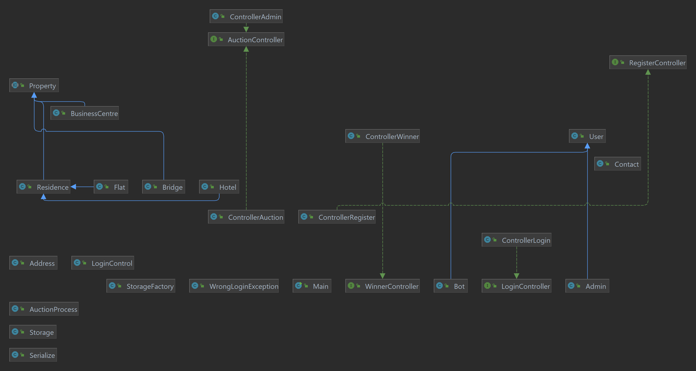
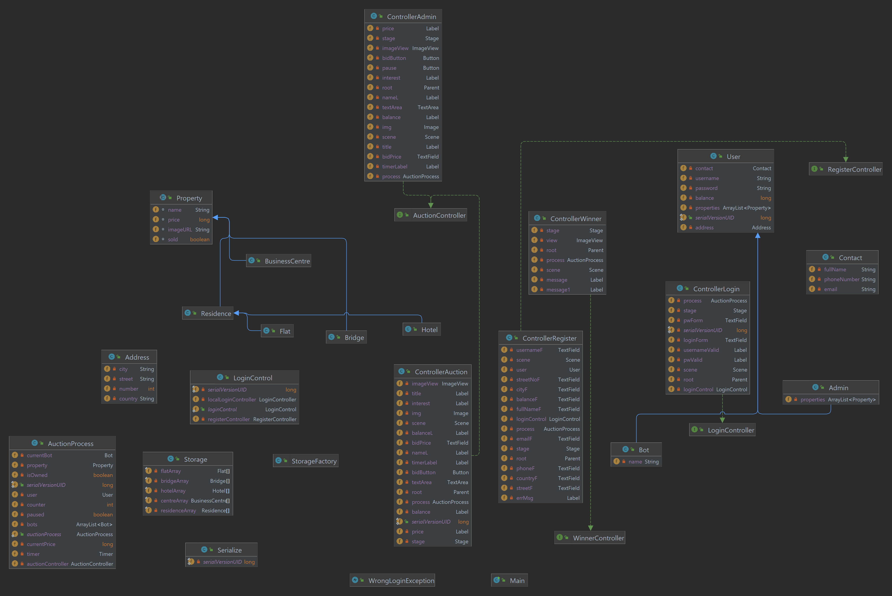
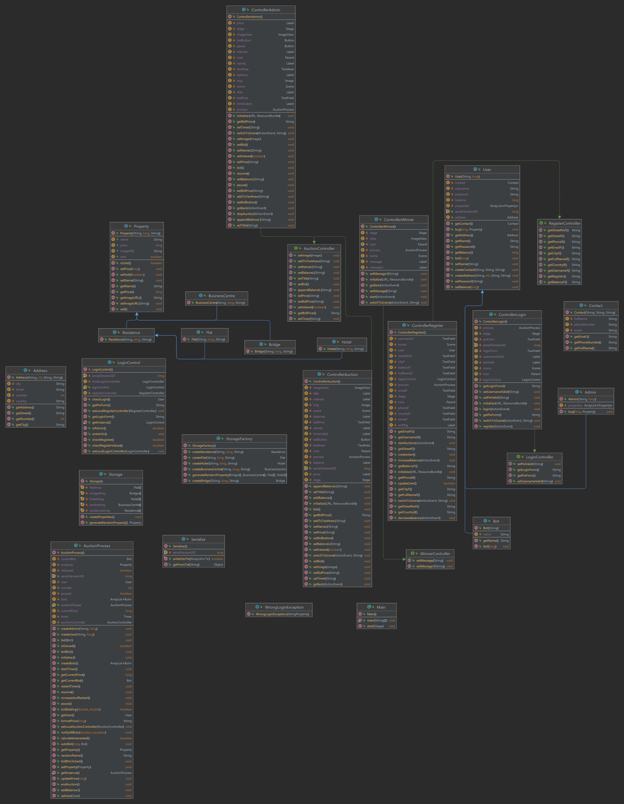

# UML diagram {#uml-diagram}

Project contains the following diagrams:
<!-- @import "[TOC]" {cmd="toc" depthFrom=1 depthTo=6 orderedList=false} -->
<!-- code_chunk_output -->

-   [UML diagram](#uml-diagram)
    -   [Use Case](#use-case)
    -   [Class diagram](#class-diagram)

<!-- /code_chunk_output -->

## Use Case {#use-case}

## Class diagram {#class-diagram}

Showcase of all classes in the project and the links between them.

## Field diagram

Showcase of all fields in the project and the links between them.

## Method diagram

Showcase of all methods in the project and the links between them.

